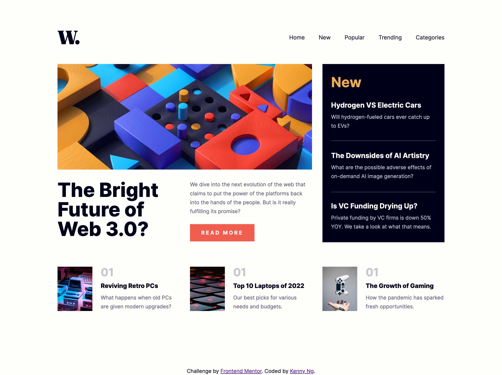
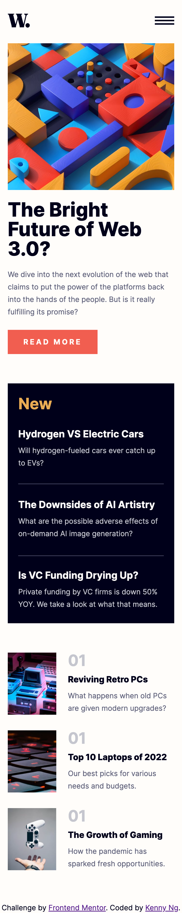

# Frontend Mentor - News homepage solution

This is a solution to the [News homepage challenge on Frontend Mentor](https://www.frontendmentor.io/challenges/news-homepage-H6SWTa1MFl). Frontend Mentor challenges help you improve your coding skills by building realistic projects.

## Table of contents

- [Overview](#overview)
  - [The challenge](#the-challenge)
  - [Screenshot](#screenshot)
  - [Links](#links)
- [My process](#my-process)
  - [Built with](#built-with)
  - [What I learned](#what-i-learned)
- [Author](#author)

## Overview

### The challenge

Users should be able to:

- View the optimal layout for the interface depending on their device's screen size
- See hover and focus states for all interactive elements on the page

### Screenshot

<p>Desktop version</p>

<p>Mobile version</p>


### Links

- Solution URL: [https://www.frontendmentor.io/solutions/responsive-news-homepage-using-react-t0wxibvCQZ](https://www.frontendmentor.io/solutions/responsive-news-homepage-using-react-t0wxibvCQZ)
- Live Site URL: [https://kennylun123.github.io/fm-news-homepage/](https://kennylun123.github.io/fm-news-homepage/)

## My process

### Built with

- Semantic HTML5 markup
- CSS custom properties
- Flexbox
- CSS Grid
- Mobile-first workflow
- CUBE CSS
- [React](https://reactjs.org/) - JS library

### What I learned

This is my first execerise using React. I tried to keep elements tidy and separated into tiny components.

- CSS Grid and Flexbox. Use `grid-template-column: 1fr 1fr 1fr` to keep columns or rows in same ratio.
- Responsive image using `<picture>` to switch imgage source.
- Use the silbling selector (~) to link up the active state of navigation button and the following classes.
  (When a nav button is activated, the related CSS should be followed)

  ```
  .nav-menu.active {
  transform: translateX(0);
  transition: all 200ms ease-in-out;
  }

  .nav-menu.active ~ .background {
  width: 100%;
  opacity: 0.5;
  }
  ```

## Author

- Website - [Kenny Ng](https://www.github.com/kennylun123)
- Frontend Mentor - [@Kenny Ng](https://www.frontendmentor.io/profile/kennylun123)
